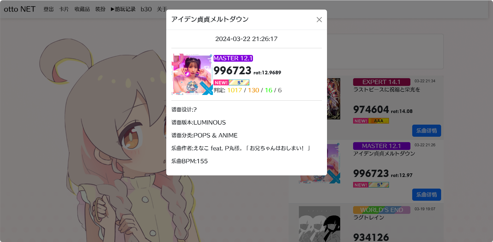

<p align="center">
 <h2 align="center">CHUNITHM ottoNET</h2>
 <p align="center">专为Chunithm rinsama本地服设计的Web服务</p>
 <p align="center">*本存储库中所使用的部分资源受株式会社SEGA的版权保护。</p>
 <p align="center">
    
    
    
	
 </p>
</p>

---


## 开始使用

数据库连接目前仅支持sqlite，请全局替换 `../rinsama-aqua/data/db.sqlite` 为实际数据库路径

1. **安装依赖** 在根目录下执行以下命令

    ```bash
    pip install -r requirements.txt
    ```


2. **运行项目** 安装完成依赖并确认数据库连接正常后，即可启动NET服务

    ```bash
    python app.py
    ```

## NET特色

- 响应式布局，移动端也能用

- 提供快速登录功能，跳过繁琐验证
- 游戏记录中可查询乐曲rating、乐曲信息等内容


- *一键获取b30，方便快捷


*b30部分代码来自watagashi-uni/Unibot

## NET简介

ottoNET是适用于本地部署的CHUNITHM独立NET服务，连接到rinsama数据库即可启动服务。

目前支持以下内容：

- 个人信息
- 游玩记录
- b30
- 收藏品查看
- *企鹅换装

*目前企鹅换装功能会导出装扮的base64编码后的id，需要手动修改数据库

未来将会支持：

- *收藏品修改
- 歌曲详情
- 排行榜

*收藏品将通过扫描HDD建立数据库

## TODO

- 最新最热
- 独立化数据库连接

## 开发者的话

ottoNET是为 自己宿舍里的音游窝 开发的NET服务。

因为不想使用在线服却又想用NET，又不能硬看数据库，就变成自己从头写一个NET了。

本人并非计算机类专业，代码也写的很烂，prpr mottomotto。

在这里感谢：

- HoshimiRIN - 2.16的数据库支持
- わたがし - b30部分代码
- chatGPT - 我的外置大脑
- rin群群友 - 大家真的很热情

以上

24.03.22
